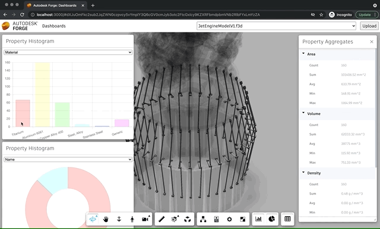

# Introduction

In this tutorial we will enhance an existing Forge application with dashboard-like
functionality, for example, retrieving and aggregating information from our designs'
metadata, displaying the results in charts and tables, and linking the results back
to the design preview.

We will be extending the sample app from the [Simple Viewer](../simple-viewer/index)
tutorial, and the complete implementation is available in the `dashboard` branch
of the original sample code for Node.js:

- https://github.com/petrbroz/forge-simple-viewer-nodejs/tree/dashboards

:::tip
With that said, you are welcome to use any other Forge application as your starting point
because the dashboard features will be implemented as viewer extensions, with all the custom
UI living _inside_ the viewer.
:::

Throughout this tutorial we will be using [Forge Viewer](https://forge.autodesk.com/en/docs/viewer/v7/developers_guide/overview)
APIs and its various features such as:

- Creating and loading viewer extensions
- Querying metadata of loaded models
- Controlling the state of the viewer
- Customizing the viewer toolbar
- Creating custom UI elements

Alright, let's get started!

... WIP ...
