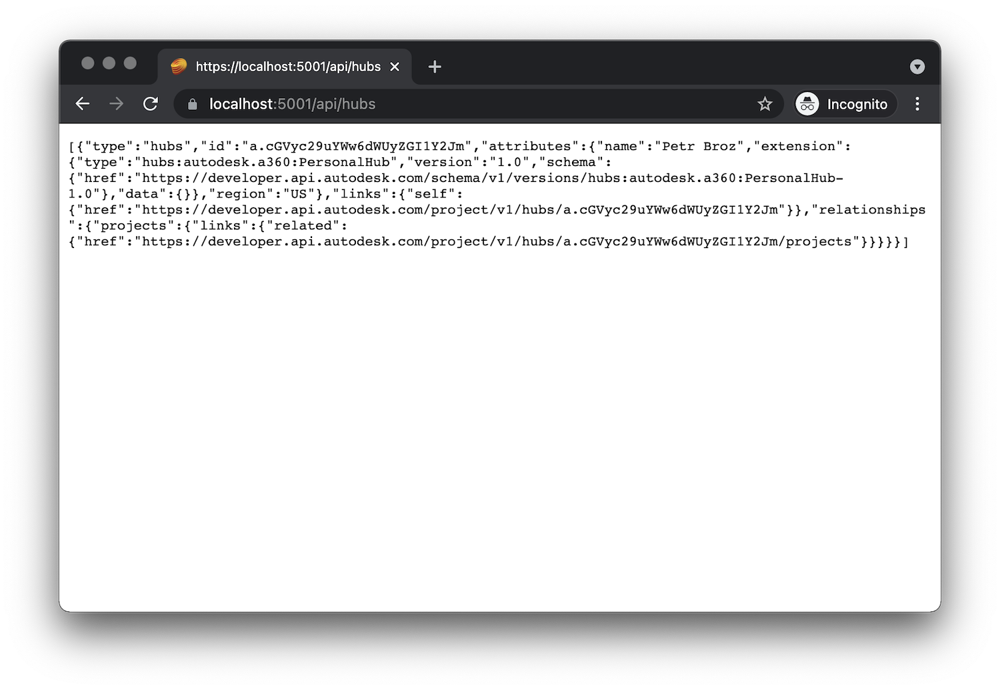

# Browsing Hubs

In this step we'll extend our server so that we can browse the content of 3rd party
applications built with Forge such as BIM 360 Docs or ACC.

## Forge helpers

First, let's add a couple of helper methods to `ForgeService` for browsing through
Data Management hubs, projects, folders, items, and versions. Create a `ForgeService.Hubs.cs`
under the `Models` subfolder with the following content:

```csharp title="Models/ForgeService.Hubs.cs"
using System.Collections.Generic;
using System.Threading.Tasks;
using Autodesk.Forge;
using Autodesk.Forge.Model;

namespace hubsbrowser
{
    public partial class ForgeService : IForgeService
    {
        public async Task<IEnumerable<dynamic>> GetHubs(Tokens tokens)
        {
            var hubs = new List<dynamic>();
            var api = new HubsApi();
            api.Configuration.AccessToken = tokens.InternalToken;
            var response = await api.GetHubsAsync();
            foreach (KeyValuePair<string, dynamic> hub in new DynamicDictionaryItems(response.data))
            {
                hubs.Add(hub.Value);
            }
            return hubs;
        }

        public async Task<IEnumerable<dynamic>> GetProjects(string hubId, Tokens tokens)
        {
            var projects = new List<dynamic>();
            var api = new ProjectsApi();
            api.Configuration.AccessToken = tokens.InternalToken;
            var response = await api.GetHubProjectsAsync(hubId);
            foreach (KeyValuePair<string, dynamic> project in new DynamicDictionaryItems(response.data))
            {
                projects.Add(project.Value);
            }
            return projects;
        }

        public async Task<IEnumerable<dynamic>> GetContents(string hubId, string projectId, string folderId, Tokens tokens)
        {
            var contents = new List<dynamic>();
            if (string.IsNullOrEmpty(folderId))
            {
                var api = new ProjectsApi();
                api.Configuration.AccessToken = tokens.InternalToken;
                var response = await api.GetProjectTopFoldersAsync(hubId, projectId);
                foreach (KeyValuePair<string, dynamic> folders in new DynamicDictionaryItems(response.data))
                {
                    contents.Add(folders.Value);
                }
            }
            else
            {
                var api = new FoldersApi();
                api.Configuration.AccessToken = tokens.InternalToken;
                var response = await api.GetFolderContentsAsync(projectId, folderId); // TODO: add paging
                foreach (KeyValuePair<string, dynamic> item in new DynamicDictionaryItems(response.data))
                {
                    contents.Add(item.Value);
                }
            }
            return contents;
        }

        public async Task<IEnumerable<dynamic>> GetVersions(string hubId, string projectId, string itemId, Tokens tokens)
        {
            var versions = new List<dynamic>();
            var api = new ItemsApi();
            api.Configuration.AccessToken = tokens.InternalToken;
            var response = await api.GetItemVersionsAsync(projectId, itemId);
            foreach (KeyValuePair<string, dynamic> version in new DynamicDictionaryItems(response.data))
            {
                versions.Add(version.Value);
            }
            return versions;
        }
    }
}
```

Next we'll need to update the `IForgeService` interface in `Models/ForgeService.cs`
to make the new methods available to our server:

```csharp title="Models/ForgeService.cs"
using System;
using System.Collections.Generic;
using System.Threading.Tasks;
using Autodesk.Forge;

namespace hubsbrowser
{
    public class Tokens
    {
        public string InternalToken;
        public string PublicToken;
        public string RefreshToken;
        public DateTime ExpiresAt;
    }

    public interface IForgeService
    {
        string GetAuthorizationURL();
        Task<Tokens> GenerateTokens(string code);
        Task<Tokens> RefreshTokens(Tokens tokens);
        Task<dynamic> GetUserProfile(Tokens tokens);
        // highlight-start
        Task<IEnumerable<dynamic>> GetHubs(Tokens tokens);
        Task<IEnumerable<dynamic>> GetProjects(string hubId, Tokens tokens);
        Task<IEnumerable<dynamic>> GetContents(string hubId, string projectId, string folderId, Tokens tokens);
        Task<IEnumerable<dynamic>> GetVersions(string hubId, string projectId, string itemId, Tokens tokens);
        // highlight-end
    }

    public partial class ForgeService : IForgeService
    {
        private readonly string _clientId;
        private readonly string _clientSecret;
        private readonly string _callbackUri;
        private readonly Scope[] InternalTokenScopes = new Scope[] { Scope.DataRead, Scope.ViewablesRead };
        private readonly Scope[] PublicTokenScopes = new Scope[] { Scope.ViewablesRead };

        public ForgeService(string clientId, string clientSecret, string callbackUri)
        {
            _clientId = clientId;
            _clientSecret = clientSecret;
            _callbackUri = callbackUri;
        }
    }
}
```

## Server endpoints

Finally, let's expose the new functionality to the client-side code through another ASP.NET
controller. Create a `HubsController.cs` file under the `Controllers` subfolder with the following
content:

```csharp title="Controllers/HubsController.cs"
using System.Threading.Tasks;
using Microsoft.AspNetCore.Mvc;
using Microsoft.Extensions.Logging;
using Newtonsoft.Json;

namespace hubsbrowser
{
    [ApiController]
    [Route("api/[controller]")]
    public class HubsController : ControllerBase
    {
        private readonly ILogger<HubsController> _logger;
        private readonly IForgeService _forgeService;

        public HubsController(ILogger<HubsController> logger, IForgeService forgeService)
        {
            _logger = logger;
            _forgeService = forgeService;
        }

        [HttpGet()]
        public async Task<ActionResult<string>> ListHubs()
        {
            var tokens = await AuthController.PrepareTokens(Request, Response, _forgeService);
            if (tokens == null)
            {
                return Unauthorized();
            }
            var hubs = await _forgeService.GetHubs(tokens);
            return JsonConvert.SerializeObject(hubs);
        }

        [HttpGet("{hub}/projects")]
        public async Task<ActionResult<string>> ListProjects(string hub)
        {
            var tokens = await AuthController.PrepareTokens(Request, Response, _forgeService);
            if (tokens == null)
            {
                return Unauthorized();
            }
            var projects = await _forgeService.GetProjects(hub, tokens);
            return JsonConvert.SerializeObject(projects);
        }

        [HttpGet("{hub}/projects/{project}/contents")]
        public async Task<ActionResult<string>> ListItems(string hub, string project, [FromQuery] string folder_id)
        {
            var tokens = await AuthController.PrepareTokens(Request, Response, _forgeService);
            if (tokens == null)
            {
                return Unauthorized();
            }
            var contents = await _forgeService.GetContents(hub, project, folder_id, tokens);
            return JsonConvert.SerializeObject(contents);
        }

        [HttpGet("{hub}/projects/{project}/contents/{item}/versions")]
        public async Task<ActionResult<string>> ListVersions(string hub, string project, string item)
        {
            var tokens = await AuthController.PrepareTokens(Request, Response, _forgeService);
            if (tokens == null)
            {
                return Unauthorized();
            }
            var versions = await _forgeService.GetVersions(hub, project, item, tokens);
            return JsonConvert.SerializeObject(versions);
        }
    }
}
```

The controller handles several endpoints for browsing the content in 3rd party Forge
applications such as BIM 360 Docs and ACC. We will make use of these endpoints when
building the UI part of the application.

## Try it out

And that's it for the server side. Time to try it out! Make sure you set all
the required environment variables, and run the application:

```bash
export FORGE_CLIENT_ID=your-own-forge-client-id
export FORGE_CLIENT_SECRET=your-own-forge-client-secret
export FORGE_CALLBACK_URL=https://localhost:5001/api/auth/callback
dotnet run
```

You should now be able to explore the new endpoints tha will eventually be used from
the UI. For example, if you go to [https://localhost:5001/api/hubs](https://localhost:5001/api/hubs),
the server should respond with a JSON list of all the hubs you have access to. Try copying the ID of
one of the hubs, and use it in another address: https://localhost:5001/api/hubs/your-hub-id/projects.
In this case the server application should respond with a JSON list of all projects
available under the specified hub.


