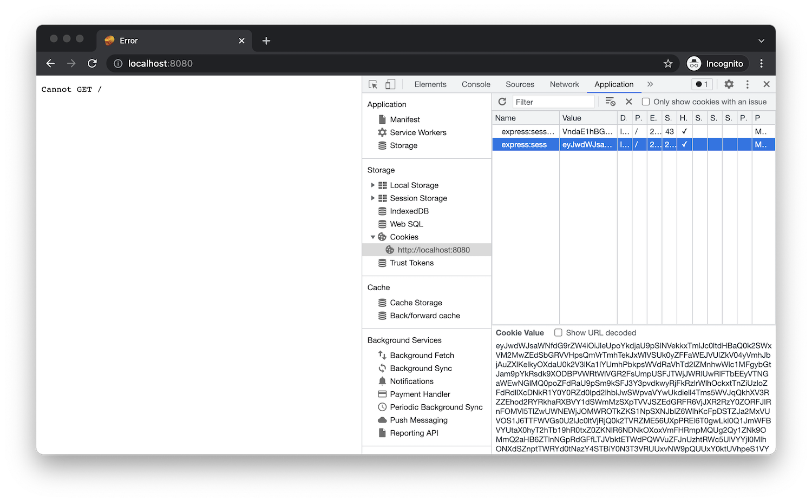

# Authentication

In this step we're going to extend the server implementation so that it can authenticate itself
to the Forge platform, guide the user through a [3-legged OAuth workflow](https://forge.autodesk.com/en/docs/oauth/v2/tutorials/get-3-legged-token),
and generate access tokens for various needs.

:::tip
It is a good practice to generate an "internal" token with more capabilities (for example,
allowing the owner to create or delete files in the Data Management service) that will only be used
by the server, and a "public" token with fewer capabilities that can be safely shared with
the client-side logic.
:::

## Token management

Create a `forge.js` file under the `services` subfolder. This is where we will be implementing
all the Forge-specific logic that will be used in different areas of our server application. Let's
start by adding the following code to the file:

```js title="services/forge.js"
const { AuthClientThreeLegged, UserProfileApi } = require('forge-apis');
const { FORGE_CLIENT_ID, FORGE_CLIENT_SECRET, FORGE_CALLBACK_URL, INTERNAL_TOKEN_SCOPES, PUBLIC_TOKEN_SCOPES } = require('../config.js');

const internalAuthClient = new AuthClientThreeLegged(FORGE_CLIENT_ID, FORGE_CLIENT_SECRET, FORGE_CALLBACK_URL, INTERNAL_TOKEN_SCOPES);
const publicAuthClient = new AuthClientThreeLegged(FORGE_CLIENT_ID, FORGE_CLIENT_SECRET, FORGE_CALLBACK_URL, PUBLIC_TOKEN_SCOPES);

function getAuthorizationUrl() {
    return internalAuthClient.generateAuthUrl();
}

async function authCallbackMiddleware(req, res, next) {
    const internalCredentials = await internalAuthClient.getToken(req.query.code);
    const publicCredentials = await publicAuthClient.refreshToken(internalCredentials);
    req.session.public_token = publicCredentials.access_token;
    req.session.internal_token = internalCredentials.access_token;
    req.session.refresh_token = publicCredentials.refresh_token;
    req.session.expires_at = Date.now() + internalCredentials.expires_in * 1000;
    next();
}

async function authRefreshMiddleware(req, res, next) {
    const { refresh_token, expires_at } = req.session;
    if (!refresh_token) {
        res.status(401).end();
        return;
    }

    if (expires_at < Date.now()) {
        const internalCredentials = await internalAuthClient.refreshToken({ refresh_token });
        const publicCredentials = await publicAuthClient.refreshToken(internalCredentials);
        req.session.public_token = publicCredentials.access_token;
        req.session.internal_token = internalCredentials.access_token;
        req.session.refresh_token = publicCredentials.refresh_token;
        req.session.expires_at = Date.now() + internalCredentials.expires_in * 1000;
    }
    req.internalOAuthToken = {
        access_token: req.session.internal_token,
        expires_in: Math.round((req.session.expires_at - Date.now()) / 1000)
    };
    req.publicOAuthToken = {
        access_token: req.session.public_token,
        expires_in: Math.round((req.session.expires_at - Date.now()) / 1000)
    };
    next();
}

async function getUserProfile(token) {
    const resp = await new UserProfileApi().getUserProfile(internalAuthClient, token);
    return resp.body;
}

module.exports = {
    getAuthorizationUrl,
    authCallbackMiddleware,
    authRefreshMiddleware,
    getUserProfile,
};
```

The script expects a couple of configuration values to be provided via environment variables:

- `FORGE_CLIENT_ID` and `FORGE_CLIENT_SECRET` are the credentials generated for you after
[creating a new Forge application](../../../intro#create-an-app)
- `FORGE_CALLBACK_URL` is the callback URL the user will be redirected to after logging
in successfully

The code then provides a couple of helper functions:

- the `getAuthorizationUrl` function generates a URL for our users to be redirected to when
initiating the 3-legged authentication workflow
- the `authCallbackMiddleware` function can be used as an Express.js middleware
when the user logs in successfully and is redirected back to our application
- the `authRefreshMiddleware` function is then used as an Express.js middleware for all requests
that will need to make use of the Forge access tokens
- the `getUserProfile` function returns additional details about the authenticated user based on
an existing access token

## Server endpoints

Next, let's add a first endpoint to our server. Create an `auth.js` file under the `routes` subfolder
with the following content:

```js title="routes/auth.js"
const express = require('express');
const { getAuthorizationUrl, authCallbackMiddleware, authRefreshMiddleware, getUserProfile } = require('../services/forge.js');

let router = express.Router();

router.get('/login', function (req, res) {
    res.redirect(getAuthorizationUrl());
});

router.get('/logout', function (req, res) {
    req.session = null;
    res.redirect('/');
});

router.get('/callback', authCallbackMiddleware, function (req, res) {
    res.redirect('/');
});

router.get('/token', authRefreshMiddleware, function (req, res) {
    res.json(req.publicOAuthToken);
});

router.get('/profile', authRefreshMiddleware, async function (req, res, next) {
    try {
        const profile = await getUserProfile(req.internalOAuthToken);
        res.json({ name: `${profile.firstName} ${profile.lastName}` });
    } catch (err) {
        next(err);
    }
});

module.exports = router;
```

Here we implement a new Express.js [router](http://expressjs.com/en/4x/api.html#router) that
will handle all the authentication-related endpoints. Let's "mount" the router to our server
application by modifying `server.js`:

```js title="server.js"
const express = require('express');
const session = require('cookie-session')
const { PORT, SERVER_SESSION_SECRET } = require('./config.js');

let app = express();
app.use(express.static('wwwroot'));
app.use(session({ secret: SERVER_SESSION_SECRET, maxAge: 24 * 60 * 60 * 1000 }));
// highlight-start
app.use('/api/auth', require('./routes/auth.js'));
// highlight-end
app.listen(PORT, () => console.log(`Server listening on port ${PORT}...`));
```

Since we've attached the router to the `/api/auth` prefix, the router will now handle the following
requests:

- `GET /api/auth/login` will redirect the user to the Autodesk login page
- `GET /api/auth/callback` is the URL our user will be redirected to after logging in successfully,
and it is where we're going to generate a new set of tokens for the user
- `GET /api/auth/logout` will remove any cookie-based session data for the given user, effectively
logging the user out of our application
- `GET /api/auth/token` will generate a public access token that will later be used by Forge Viewer
to load our designs
- `GET /api/auth/profile` will return a simple JSON with additional information about the logged in user

## Try it out

Let's see if our new server endpoint works. Try setting the `FORGE_CLIENT_ID` and `FORGE_CLIENT_SECRET`
environment variables to your own Forge app credentials, and set the `FORGE_CALLBACK_URL` env.
variable to `http://localhost:8080/api/auth/callback` because that's where we implemented our
code handling the callbacks from Forge:

```bash
export SERVER_SESSION_SECRET=some-secret-phrase
export FORGE_CLIENT_ID=your-own-forge-client-id
export FORGE_CLIENT_SECRET=your-own-forge-client-secret
export FORGE_CALLBACK_URL=http://localhost:8080/api/auth/callback
npm start
```

:::caution
The callback URL we specify here must match the callback URL that you've configured
for your Forge application on https://forge.autodesk.com/myapps.
:::

When you navigate to [http://localhost:8080/api/auth/login](http://localhost:8080/api/auth/login)
in the browser, you should be redirected to Autodesk login page, and after logging in,
you should be redirected back to your application, for now simply showing `Cannot GET /`.
This is expected as we haven't implemented the `GET /` endpoint yet. However, if you try
and explore the cookies stored by your browser for the `localhost` origin,
you'll notice that the application is already storing the session data in an `express:sess` cookie.
That is where we will get our tokens from later in this tutorial.


