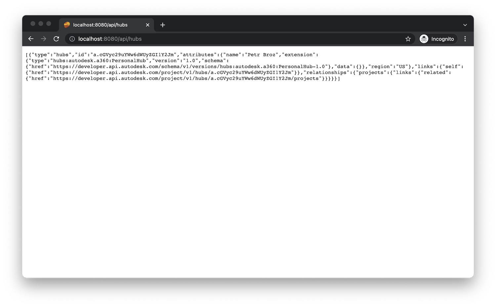

# Browsing Hubs

In this step we'll extend our server so that we can browse the content of 3rd party
applications built with Forge such as BIM 360 Docs or ACC.

## Forge helpers

First, let's add a couple of helper functions to `services/forge.js` for browsing through
Data Management hubs, projects, folders, items, and versions:

```js title="services/forge.js"
// highlight-start
const { AuthClientThreeLegged, UserProfileApi, HubsApi, ProjectsApi, FoldersApi, ItemsApi } = require('forge-apis');
// highlight-end

const { FORGE_CLIENT_ID, FORGE_CLIENT_SECRET, FORGE_CALLBACK_URL } = process.env;
if (!FORGE_CLIENT_ID || !FORGE_CLIENT_SECRET || !FORGE_CALLBACK_URL) {
    console.warn('Missing some of the environment variables.');
    process.exit(1);
}
const INTERNAL_TOKEN_SCOPES = ['data:read'];
const PUBLIC_TOKEN_SCOPES = ['viewables:read'];

function getAuthorizationUrl() {
    return 'https://developer.api.autodesk.com' +
        '/authentication/v1/authorize?response_type=code' +
        '&client_id=' + FORGE_CLIENT_ID +
        '&redirect_uri=' + FORGE_CALLBACK_URL +
        '&scope=' + INTERNAL_TOKEN_SCOPES.join(' ');
}

const internalAuthClient = new AuthClientThreeLegged(FORGE_CLIENT_ID, FORGE_CLIENT_SECRET, FORGE_CALLBACK_URL, INTERNAL_TOKEN_SCOPES);
const publicAuthClient = new AuthClientThreeLegged(FORGE_CLIENT_ID, FORGE_CLIENT_SECRET, FORGE_CALLBACK_URL, PUBLIC_TOKEN_SCOPES);

async function authCallbackMiddleware(req, res, next) {
    const internalCredentials = await internalAuthClient.getToken(req.query.code);
    const publicCredentials = await publicAuthClient.refreshToken(internalCredentials);
    req.session.public_token = publicCredentials.access_token;
    req.session.internal_token = internalCredentials.access_token;
    req.session.refresh_token = publicCredentials.refresh_token;
    req.session.expires_at = Date.now() + internalCredentials.expires_in * 1000;
    next();
}

async function authRefreshMiddleware(req, res, next) {
    const { refresh_token, expires_at } = req.session;
    if (!refresh_token) {
        res.status(401).end();
        return;
    }

    if (expires_at < Date.now()) {
        const internalCredentials = await internalAuthClient.refreshToken({ refresh_token });
        const publicCredentials = await publicAuthClient.refreshToken(internalCredentials);
        req.session.public_token = publicCredentials.access_token;
        req.session.internal_token = internalCredentials.access_token;
        req.session.refresh_token = publicCredentials.refresh_token;
        req.session.expires_at = Date.now() + internalCredentials.expires_in * 1000;
    }
    req.internalOAuthToken = {
        access_token: req.session.internal_token,
        expires_in: Math.round((req.session.expires_at - Date.now()) / 1000)
    };
    req.publicOAuthToken = {
        access_token: req.session.public_token,
        expires_in: Math.round((req.session.expires_at - Date.now()) / 1000)
    };
    next();
}

async function getUserProfile(token) {
    const resp = await new UserProfileApi().getUserProfile(internalAuthClient, token);
    return resp.body;
}

// highlight-start
async function getHubs(token) {
    const resp = await new HubsApi().getHubs(null, internalAuthClient, token);
    return resp.body.data;
}
// highlight-end

// highlight-start
async function getProjects(hubId, token) {
    const resp = await new ProjectsApi().getHubProjects(hubId, null, internalAuthClient, token);
    return resp.body.data;
}
// highlight-end

// highlight-start
async function getProjectContents(hubId, projectId, folderId, token) {
    if (!folderId) {
        const resp = await new ProjectsApi().getProjectTopFolders(hubId, projectId, internalAuthClient, token);
        return resp.body.data;
    } else {
        const resp = await new FoldersApi().getFolderContents(projectId, folderId, null, internalAuthClient, token);
        return resp.body.data;
    }
}
// highlight-end

// highlight-start
async function getItemVersions(projectId, itemId, token) {
    const resp = await new ItemsApi().getItemVersions(projectId, itemId, null, internalAuthClient, token);
    return resp.body.data;
}
// highlight-end

module.exports = {
    getAuthorizationUrl,
    authCallbackMiddleware,
    authRefreshMiddleware,
    getUserProfile,
    // highlight-start
    getHubs,
    getProjects,
    getProjectContents,
    getItemVersions
    // highlight-end
};
```

## Server endpoints

Next, let's expose the new functionality to the client-side code through another
Express router. Create a `hubs.js` file under the `routes` subfolder with the following
content:

```js title="routes/hubs.js"
const express = require('express');
const { authRefreshMiddleware, getHubs, getProjects, getProjectContents, getItemVersions } = require('../services/forge.js');

let router = express.Router();

router.use(authRefreshMiddleware);

router.get('/', async function (req, res, next) {
    try {
        const hubs = await getHubs(req.internalOAuthToken);
        res.json(hubs);
    } catch (err) {
        next(err);
    }
});

router.get('/:hub_id/projects', async function (req, res, next) {
    try {
        const projects = await getProjects(req.params.hub_id, req.internalOAuthToken);
        res.json(projects);
    } catch (err) {
        next(err);
    }
});

router.get('/:hub_id/projects/:project_id/contents', async function (req, res, next) {
    try {
        const contents = await getProjectContents(req.params.hub_id, req.params.project_id, req.query.folder_id, req.internalOAuthToken);
        res.json(contents);
    } catch (err) {
        next(err);
    }
});

router.get('/:hub_id/projects/:project_id/contents/:item_id/versions', async function (req, res, next) {
    try {
        const versions = await getItemVersions(req.params.project_id, req.params.item_id, req.internalOAuthToken);
        res.json(versions);
    } catch (err) {
        next(err);
    }
});

module.exports = router;
```

And mount the router to our server application by modifying `server.js`:

```js title="server.js"
const express = require('express');
const session = require('cookie-session')
const PORT = process.env.PORT || 3000;

let app = express();
app.use(express.static('public'));
app.use(session({
    secret: process.env.SERVER_SESSION_SECRET,
    maxAge: 24 * 60 * 60 * 1000,
}));
app.use('/api/auth', require('./routes/auth.js'));
// highlight-start
app.use('/api/hubs', require('./routes/hubs.js'));
// highlight-end
app.use(function (err, req, res, next) {
    console.error(err);
    res.status(500).send(err.message);
});
app.listen(PORT, () => console.log(`Server listening on port ${PORT}...`));
```

## Try it out

And that's it for the server side of our application. Time to try it out!
Make sure you set all the required environment variables, and run the application:

```bash
export SERVER_SESSION_SECRET=some-secret-phrase
export FORGE_CLIENT_ID=your-own-forge-client-id
export FORGE_CLIENT_SECRET=your-own-forge-client-secret
export FORGE_CALLBACK_URL=http://localhost:3000/api/auth/callback
npm start
```

You should now be able to explore the new endpoints tha will eventually be used from
the UI. For example, if you go to [http://localhost:3000/api/hubs](http://localhost:3000/api/hubs),
the server should respond with a JSON list of all the hubs you have access to. Try copying the ID of
one of the hubs, and use it in another address: http://localhost:3000/api/hubs/your-hub-id/projects.
In this case the server application should respond with a JSON list of all projects
available under the specified hub.


