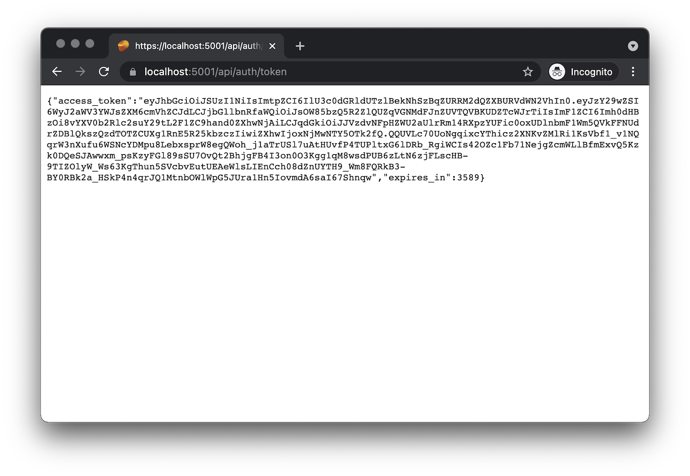

# Authentication

In this step we're going to extend the server implementation so that it can authenticate itself
to the Forge platform, and generate access tokens for various needs.

:::tip
It is a good practice to generate an "internal" token with more capabilities (for example,
allowing the owner to create or delete files in the Data Management service) that will only be used
by the server, and a "public" token with fewer capabilities that can be safely shared with
the client-side logic.
:::

## Token management

Create a `ForgeService.cs` file under the `Models` subfolder. That is where we will be implementing
all the Forge-specific logic that will be used in different areas of our server application. Let's
start by adding the following code to the file:

```csharp title="Models/ForgeService.cs"
using System;
using System.Collections.Generic;
using System.IO;
using System.Threading.Tasks;
using Autodesk.Forge;
using Autodesk.Forge.Client;
using Autodesk.Forge.Model;

public record Token(string AccessToken, DateTime ExpiresAt);

public class ForgeService
{
    private readonly string _clientId;
    private readonly string _clientSecret;
    private Token _internalTokenCache;
    private Token _publicTokenCache;

    public ForgeService(string clientId, string clientSecret, string bucket = null)
    {
        _clientId = clientId;
        _clientSecret = clientSecret;
    }

    private async Task<Token> GetToken(Scope[] scopes)
    {
        dynamic auth = await new TwoLeggedApi().AuthenticateAsync(_clientId, _clientSecret, "client_credentials", scopes);
        return new Token(auth.access_token, DateTime.UtcNow.AddSeconds(auth.expires_in));
    }

    public async Task<Token> GetPublicToken()
    {
        if (_publicTokenCache == null || _publicTokenCache.ExpiresAt < DateTime.UtcNow)
            _publicTokenCache = await GetToken(new Scope[] { Scope.ViewablesRead });
        return _publicTokenCache;
    }

    private async Task<Token> GetInternalToken()
    {
        if (_internalTokenCache == null || _internalTokenCache.ExpiresAt < DateTime.UtcNow)
            _internalTokenCache = await GetToken(new Scope[] { Scope.BucketCreate, Scope.BucketRead, Scope.DataRead, Scope.DataWrite, Scope.DataCreate });
        return _internalTokenCache;
    }
}
```

The helper class takes the credentials of a Forge application, and creates two authentication clients,
one for internal use (giving us read/write access to the Data Management buckets and objects), and one
for public use (only allowing access to the translation outputs from the Model Derivative service),
and a couple of methods for generating the corresponding tokens for us.

Next, let's update our `Startup.cs` file to make a singleton instance of the `ForgeService` class
available to our server application:

```csharp title="Startup.cs"
using System;
using Microsoft.AspNetCore.Builder;
using Microsoft.AspNetCore.Hosting;
using Microsoft.Extensions.Configuration;
using Microsoft.Extensions.DependencyInjection;
using Microsoft.Extensions.Hosting;

public class Startup
{
    public Startup(IConfiguration configuration)
    {
        Configuration = configuration;
    }

    public IConfiguration Configuration { get; }

    // This method gets called by the runtime. Use this method to add services to the container.
    public void ConfigureServices(IServiceCollection services)
    {
        services.AddControllers();
        var ForgeClientID = Environment.GetEnvironmentVariable("FORGE_CLIENT_ID");
        var ForgeClientSecret = Environment.GetEnvironmentVariable("FORGE_CLIENT_SECRET");
        var ForgeBucket = Environment.GetEnvironmentVariable("FORGE_BUCKET"); // Optional
        if (string.IsNullOrEmpty(ForgeClientID) || string.IsNullOrEmpty(ForgeClientSecret))
        {
            throw new ApplicationException("Missing required environment variables FORGE_CLIENT_ID or FORGE_CLIENT_SECRET.");
        }
        // highlight-start
        services.AddSingleton<ForgeService>(new ForgeService(ForgeClientID, ForgeClientSecret, ForgeBucket));
        // highlight-end
    }

    // This method gets called by the runtime. Use this method to configure the HTTP request pipeline.
    public void Configure(IApplicationBuilder app, IWebHostEnvironment env)
    {
        if (env.IsDevelopment())
        {
            app.UseDeveloperExceptionPage();
        }
        app.UseHttpsRedirection();
        app.UseDefaultFiles();
        app.UseStaticFiles();
        app.UseRouting();
        app.UseEndpoints(endpoints =>
        {
            endpoints.MapControllers();
        });
    }
}
```

## Server endpoints

Now let's add a first endpoint to our server. Create an `AuthController.cs` file under the `Controllers`
subfolder with the following content:

```csharp title="Controllers/AuthController.cs"
using System;
using System.Threading.Tasks;
using Microsoft.AspNetCore.Mvc;

[ApiController]
[Route("api/[controller]")]
public class AuthController : ControllerBase
{
    public record AccessToken(string access_token, long expires_in);

    private readonly ForgeService _forgeService;

    public AuthController(ForgeService forgeService)
    {
        _forgeService = forgeService;
    }

    [HttpGet("token")]
    public async Task<AccessToken> GetAccessToken()
    {
        var token = await _forgeService.GetPublicToken();
        return new AccessToken(
            token.AccessToken,
            (long)Math.Round((token.ExpiresAt - DateTime.UtcNow).TotalSeconds)
        );
    }
}
```

The controller will receive the instance of `ForgeService` through ASP.NET's
[Dependency injection](https://docs.microsoft.com/en-us/aspnet/core/fundamentals/dependency-injection?view=aspnetcore-6.0),
and it will handle requests to `/api/auth/token` by generating a new access token
and sending it back to the client as a JSON payload.

## Try it out

Let's see if our new server endpoint works. Try setting your own Forge client ID and client secret
as the `FORGE_CLIENT_ID` and `FORGE_CLIENT_SECRET` environment variables, and run the application:

```bash
export FORGE_CLIENT_ID=your-own-forge-client-id
export FORGE_CLIENT_SECRET=your-own-forge-client-secret
dotnet run
```

If the server starts successfully and you navigate to [https://localhost:5001/api/auth/token](https://localhost:5001/api/auth/token)
in the browser, the server should respond with a JSON object containing the access token data.


