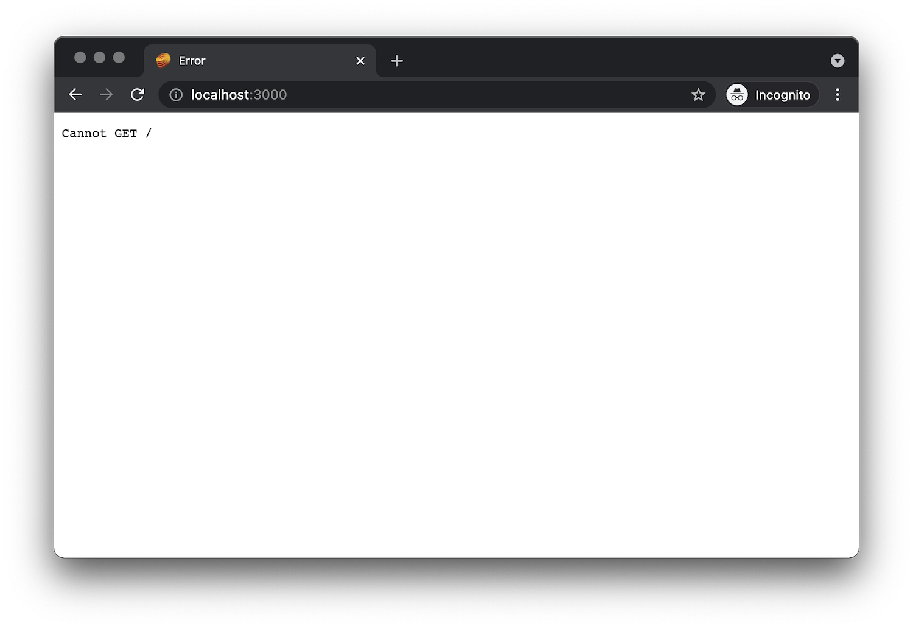

# Basic Server

In this step we're going to create a new Node.js project, install all the required dependencies,
and setup a basic Node.js server.

## Project & dependencies

Create a new folder for your project, navigate to it in the command line, and initialize a new
Node.js project:

```bash
npm init -y
```

Next, install all the Node.js dependencies we're going to use. In this case it will be
the [Express.js](https://expressjs.com) framework, a middleware for handling `multipart/form-data`
requests, and finally the [Forge SDK](https://www.npmjs.com/package/forge-apis):

```bash
npm install --save express express-formidable forge-apis
```

The `"dependencies"` in your `package.json` file should now look something like this (potentially
with slightly different version numbers):

```json
// ...
"dependencies": {
    "express": "^4.17.1",
    "express-formidable": "^1.2.0",
    "forge-apis": "^0.8.6"
}
// ...
```

Finally, let's create a couple of subfolders in your project folder that we're going to need later:

- `public` - this is where we're going to put all the client side assets (HTML, CSS, JavaScript, images, etc.)
- `routes` - this is where we're going to implement all the server endpoints
- `services` - here we're going to keep all the server-side logic that can be shared by different endpoints


## Create a basic server

Create a `server.js` file in the root of your project folder with the following code:

```js title="server.js"
const express = require('express');
const PORT = process.env.PORT || 3000;

let app = express();
app.use(express.static('public'));
app.use(function (err, req, res, next) {
    console.error(err);
    res.status(500).send(err.message);
});
app.listen(PORT, function () { console.log(`Server listening on port ${PORT}...`); });
```

For now the server isn't doing much, just serving client side assets from the `public` subfolder,
and reporting all errors to the console and back to the client.

Next, let's add a `"start": "node server.js"` script to the `package.json` file so that we can
easily run our application later:

```json
// ...
"scripts": {
    "start": "node server.js"
}
// ...
```

## Try it out

Try running the application from the command line:

```bash
npm start
```

Then open your browser and navigate to http://localhost:3000. The server should respond
with `Cannot GET /` because we haven't added any logic to it just yet.



That's going to be the topic of step 2 - [Authentication](./auth).
